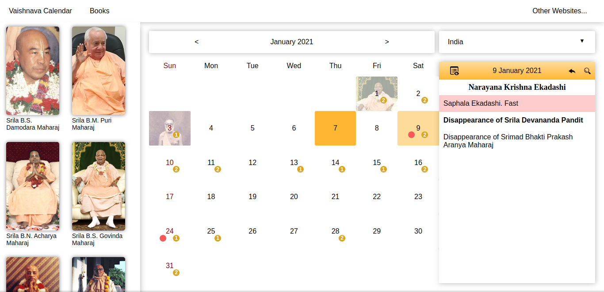
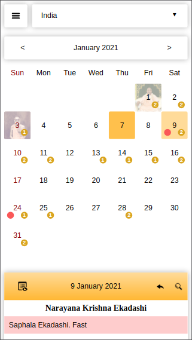

# Vaishnava App

> Web App from Sri Chaitanya Saraswat Math under the guidance of Sadhu, Guru and Vaishnava.

## Screenshot

### Desktop:

### Mobile:

## Description

Vaishnava App is a useful tool for followers of Sri Chaitanya Saraswat Math. It has the calendar with all events at SCSMath and a set of books from Vaishnavas.

## Built With

- Vue CLI
- JavaScript
- HTML
- CSS
- VScode

## Demo Link

[Live App](https://scsmathapp.github.io/vaishnava/)

## Contributing

Contributions, issues and feature requests are welcome! Start by:

  - Forking the project
  - Cloning the project to your local machine
  - cd into the project directory
  - Run git checkout -b your-branch-name
  - Make your contributions
  - Push your branch up to your forked repository
  - Open a Pull Request with a detailed description to the development branch of the original project for a review

## Author

👤 Suyash Fowdar
Github: [@Krishnzzz](https://github.com/krishnzzz)

## Show your Support
Give a ⭐ if you like this project!
